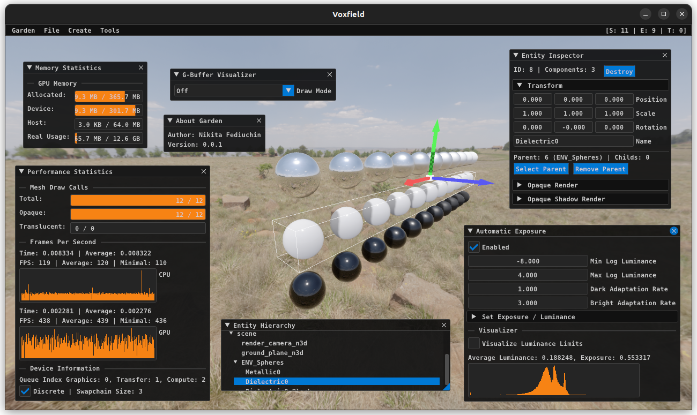

# Garden



Garden is an open source, cross platform game engine designed for efficiency and flexibility. Written in 
modern C++ and utilizing the Vulkan API for rendering, it is aimed at providing developers with a robust 
toolset for creating high-performance, visually stunning games. The main features of the engine include 
extensible architecture, built-in editor, convenient creation of rendering pipelines using a custom 
shader language (GSL), and automatic placement of GPU memory barriers, which are necessary in recent 
graphics APIs.

Check out the Garden [demo](https://github.com/cfnptr/garden-demo) app.

## Supported operating systems

* Windows (10/11)
* Ubuntu (22.04/24.04)
* macOS (15/26)

This list includes only those systems on which functionality testing is conducted.
However, you can also compile it under any other Linux distribution or operating system.

## Supported hardware

### Graphics processing unit (GPU)

* Nvidia [Kepler](https://en.wikipedia.org/wiki/Kepler_(microarchitecture)) microarchitecture and newer
* AMD [GCN](https://en.wikipedia.org/wiki/Graphics_Core_Next) microarchitecture and newer
* Intel [Gen9](https://en.wikichip.org/wiki/intel/microarchitectures/gen9) microarchitecture and newer
* Apple [M1](https://en.wikipedia.org/wiki/Apple_M1) integrated GPU and newer (partial support)

At least GPU with Vulkan API 1.2 support.

### Central processing unit (CPU)

* Intel [Haswell](https://en.wikipedia.org/wiki/Haswell_(microarchitecture)) microarchitecture and newer
* AMD [Excavator](https://en.wikipedia.org/wiki/Excavator_(microarchitecture)) microarchitecture and newer
* Apple [M1](https://en.wikipedia.org/wiki/Apple_M1) processor and newer

These requirements are based on the support of the [AVX2](https://en.wikipedia.org/wiki/Advanced_Vector_Extensions) 
instruction set in the x86 architecture. If you want, you can freely disable it and compile for older x86 CPUs.

## Build requirements 

* C++17 compiler
* [Git 2.39+](https://git-scm.com)
* [CMake 3.25+](https://cmake.org)
* [Vulkan SDK 1.4+](https://vulkan.lunarg.com/)
* [vcpkg](https://learn.microsoft.com/en-us/vcpkg/) (Windows only)
* [brew](https://brew.sh/) (macOS only)

Use building [instructions](BUILDING.md) to install all required tools and libraries.

### CMake options

| Name                        | Description                                      | Default value |
|-----------------------------|--------------------------------------------------|---------------|
| GARDEN_USE_AVX2             | Use AVX2 instruction set (Better perf)           | `ON`          |
| GARDEN_BUILD_GSLC           | Build GSL shader compiler                        | `ON`          |
| GARDEN_BUILD_MODELC         | Build Garden model converter                     | `ON`          |
| GARDEN_BUILD_JSON2BSON      | Build JSON to binary JSON converter              | `ON`          |
| GARDEN_BUILD_EQUI2CUBE      | Build equirectangular to cubemap converter       | `ON`          |
| GARDEN_RELEASE_EDITOR       | Build Garden editor in the release build         | `OFF`         |
| GARDEN_RELEASE_DEBUGGING    | Build Garden debugging code in the release build | `OFF`         |
| GARDEN_DEBUG_SHADERS        | Compile GSL shaders with no optimzations         | `OFF`         |
| GARDEN_DEBUG_BUILD_TOOLS    | Build Garden tools in the debug build            | `OFF`         |
| GARDEN_DEBUG_PACK_RESOURCES | Pack and load resources in the debug build       | `OFF`         |
| GARDEN_USE_GAPI_VALIDATIONS | Use graphics API validation layers               | `ON`          |
| GARDEN_USE_TRACY_PROFILER   | Use Tracy frame profiler                         | `OFF`         |
| GARDEN_USE_ASAN             | Use Clang address sanitizer                      | `OFF`         |
| GARDEN_USE_MESA_RGP         | Use Mesa Radeon GPU Profiler (RGP)               | `OFF`         |
| GARDEN_USE_NVIDIA_DLSS      | Use Nvidia DLSS SDK (Auto-downloads repo)        | `OFF`         |
| GARDEN_USE_STEAMWORKS_SDK   | Use Valve Steamworks SDK (Download it manually!) | `OFF`         |

### CMake variables

| Name                          | Description                        | Default value                          |
|-------------------------------|------------------------------------|----------------------------------------|
| GARDEN_APP_NAME               | Application name                   | `Garden App`                           |
| GARDEN_APP_NAME_LOWERCASE     | Application lowercase name         | `garden-app`                           |
| GARDEN_APP_NAMESPACE          | Application C++ namespace name     | `garden::app`                          |
| GARDEN_APP_FILE_NAME          | Application file name (executable) | `Garden App`                           |
| GARDEN_APP_ICON_PATH          | Application icon file path         |                                        |
| GARDEN_APP_DESCRIPTION        | Application description            | `Made using Garden engine.`            |
| GARDEN_APP_CREATOR            | Application creator (company)      | `Garden`                               |
| GARDEN_APP_COPYRIGHT          | Application copyright (license)    | `20XX {name}. All rights reserved.`    |
| GARDEN_APP_VERSION_MAJOR      | Application major version          | `1`                                    |
| GARDEN_APP_VERSION_MINOR      | Application minor version          | `0`                                    |
| GARDEN_APP_VERSION_PATCH      | Application patch version          | `0`                                    |
| GARDEN_APP_RESOURCES_DIR      | Application resources directory    | `garden/resources/default`             |
| GARDEN_APP_CACHE_DIR          | Application cache directory        | `garden/.cache`                        |
| GARDEN_STEAMWORKS_SDK_DIR     | Valve Steamworks SDK directory     | `libraries/steamworks-sdk`             |
| GARDEN_NVIDIA_DLSS_APP_ID     | Nvidia DLSS application ID         |                                        |
| GARDEN_NVIDIA_DLSS_PROJECT_ID | Nvidia DLSS project ID (GUID)      | `5df9fb9c-bec4-4cf0-99c4-27b54fd7237e` |

### Environment variable

| Name                          | Description                        |
|-------------------------------|------------------------------------|
| GLFW_PLATFORM                 | Force specific window system (x11) |

### CMake targets

| Name   | Description            | Windows | macOS  | Linux |
|--------|------------------------|---------|--------|-------|
| garden | Static Garden library  | `.lib`  | `.a`   | `.a`  |
| {name} | Application executable | `.exe`  | `.app` |       |

## Cloning

```
git clone --recursive https://github.com/cfnptr/garden
```

## Garden Shading Language (GSL)

Documentation with all GLSL changes is [here](docs/GSL.md).
You can install **Visual Studio Code** [extension](https://marketplace.visualstudio.com/items?itemName=cfnptr.gsl-linter) to highlight GSL code.

## Third-party

* [Assimp](https://github.com/assimp/assimp) (assimp license)
* [Conf](https://github.com/cfnptr/conf) (Apache-2.0 license)
* [cURL](https://github.com/curl/curl) (curl License)
* [ECSM](https://github.com/cfnptr/ecsm) (Apache-2.0 license)
* [FastNoise2](https://github.com/Auburn/FastNoise2) (MIT license)
* [FreeType](https://github.com/freetype/freetype) (FreeType license)
* [GLFW](https://github.com/glfw/glfw) (zlib license)
* [ImGui](https://github.com/ocornut/imgui) (MIT license)
* [JoltPhysics](https://github.com/jrouwe/JoltPhysics) (MIT license)
* [JSON](https://github.com/nlohmann/json) (MIT license)
* [Logy](https://github.com/cfnptr/logy) (Apache-2.0 license)
* [Math](https://github.com/cfnptr/math) (Apache-2.0 license)
* [Nets](https://github.com/cfnptr/nets) (Apache-2.0 license)
* [OpenSSL](https://github.com/openssl/openssl) (Apache-2.0 license)
* [Pack](https://github.com/cfnptr/pack) (Apache-2.0 license)
* [PNG](https://github.com/pnggroup/libpng) (PNG-2 license)
* [stb](https://github.com/nothings/stb) (MIT license)
* [TinyEXR](https://github.com/syoyo/tinyexr) (BSD-3-Clause license)
* [TinyGLTF](https://github.com/syoyo/tinygltf) (MIT license)
* [Tracy](https://github.com/wolfpld/tracy) (BSD-3-Clause license)
* [VulkanMemoryAllocator](https://github.com/GPUOpen-LibrariesAndSDKs/VulkanMemoryAllocator) (MIT license)
* [Vulkan SDK](https://github.com/KhronosGroup) (Apache-2.0 license)
* [volk](https://github.com/zeux/volk) (MIT license)
* [Voxy](https://github.com/cfnptr/voxy) (Apache-2.0 license)
* [WebP](https://github.com/webmproject/libwebp) (BSD-3-Clause license)
* [xxHash](https://github.com/Cyan4973/xxHash) (BSD-2-Clause license)
* [zlib](https://github.com/madler/zlib) (zlib license)


## Physically Based Materials


## Trademarks

DLSS (Deep Learning Super Sampling) is a registered trademark of NVIDIA Corporation.