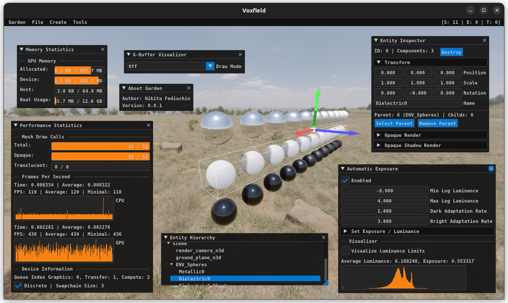

# Garden Engine



Garden is an open-source, cross-platform game engine written in [C++](https://en.wikipedia.org/wiki/C%2B%2B) that utilizes the 
Entity-Component-System ([ECS](https://en.wikipedia.org/wiki/Entity_component_system)) architectural pattern. The renderer is 
built on the [Vulkan](https://en.wikipedia.org/wiki/Vulkan) graphics API and features a custom shading language [GSL](docs/GSL.md) 
(a [GLSL](https://en.wikipedia.org/wiki/OpenGL_Shading_Language) dialect). The engine's primary goal is the creation of open, 
[procedurally](https://en.wikipedia.org/wiki/Procedural_generation) generated worlds, leveraging the latest GPU technologies and 
advanced rendering techniques, such as ray tracing and advanced compute shaders. Garden's architecture is designed to utilize 
all available hardware resources to reach maximum performance while remaining as developer-friendly and easy to use as possible.

### !!! Work in progress !!!

The engine is under development right now, expect major architecture changes and instabilities. <br>
If you need stable and production ready solution it's better to use [Godot](https://godotengine.org/) or [Unreal Engine](https://www.unrealengine.com/).

## Supported hardware

### Graphics processing unit (GPU)

* Nvidia [Kepler](https://en.wikipedia.org/wiki/Kepler_(microarchitecture)) microarchitecture and newer
* AMD [GCN](https://en.wikipedia.org/wiki/Graphics_Core_Next) microarchitecture and newer
* Intel [Gen9](https://en.wikichip.org/wiki/intel/microarchitectures/gen9) microarchitecture and newer
* Apple [M1](https://en.wikipedia.org/wiki/Apple_M1) integrated GPU and newer (partial support)

Or at least GPU with [Vulkan API](https://vulkan.gpuinfo.org/listreports.php?property=apiversion&value=1.2&platform=all) 1.2 support.

### Central processing unit (CPU)

* Intel [Haswell](https://en.wikipedia.org/wiki/Haswell_(microarchitecture)) microarchitecture and newer
* AMD [Excavator](https://en.wikipedia.org/wiki/Excavator_(microarchitecture)) microarchitecture and newer
* Apple [M1](https://en.wikipedia.org/wiki/Apple_M1) processor and newer

These requirements are based on support of the [AVX2](https://en.wikipedia.org/wiki/Advanced_Vector_Extensions) 
instruction set in the x86 architecture. <br>
If you want, you can freely disable it and compile for older x86 CPUs, or any other architecture.

## Garden Shading Language (GSL)

GSL is a GLSL dialect, created to simplify the usage of Vulkan GLSL [subset](https://github.com/KhronosGroup/GLSL/blob/main/extensions/khr/GL_KHR_vulkan_glsl.txt). Documentation with all changes is [here](docs/GSL.md). <br>
Also you can install the **Visual Studio Code** [extension](https://marketplace.visualstudio.com/items?itemName=cfnptr.gsl-linter) to highlight GSL code and see functions description.

## Cloning

```
git clone --recursive -j8 https://github.com/cfnptr/garden
```

* `--recursive`: recursively clones all required git submodules
* `-j`: number of git submodules fetched in parallel

## Build requirements 

* C++17 compiler
* [Git 2.53+](https://git-scm.com)
* [CMake 3.25+](https://cmake.org)
* [vcpkg](https://learn.microsoft.com/en-us/vcpkg/) (Windows only)
* [brew](https://brew.sh/) (macOS only)

Use building [instructions](BUILDING.md) to install all required tools and libraries.

### CMake options

| Name                        | Description                                      | Default value |
|-----------------------------|--------------------------------------------------|---------------|
| GARDEN_USE_AVX2             | Use AVX2 instruction set (Better perf)           | `ON`          |
| GARDEN_BUILD_EDITOR         | Build base Garden editor                         | `ON`          |
| GARDEN_BUILD_GSLC           | Build GSL shader compiler                        | `ON`          |
| GARDEN_BUILD_MODELC         | Build Garden model converter                     | `ON`          |
| GARDEN_BUILD_JSON2BSON      | Build JSON to binary JSON converter              | `ON`          |
| GARDEN_BUILD_EQUI2CUBE      | Build equirectangular to cubemap converter       | `ON`          |
| GARDEN_RELEASE_EDITOR       | Build Garden editor in the release build         | `OFF`         |
| GARDEN_RELEASE_DEBUGGING    | Build Garden debugging code in the release build | `OFF`         |
| GARDEN_DEBUG_PACK_RESOURCES | Pack and load resources in the debug build       | `OFF`         |
| GARDEN_USE_GAPI_VALIDATIONS | Use graphics API validation layers               | `ON`          |
| GARDEN_USE_TRACY_PROFILER   | Use Tracy frame profiler                         | `OFF`         |
| GARDEN_USE_ASAN             | Use Clang address sanitizer                      | `OFF`         |
| GARDEN_USE_MESA_RGP         | Use Mesa Radeon GPU Profiler (RGP)               | `OFF`         |
| GARDEN_USE_NVIDIA_DLSS      | Use Nvidia DLSS SDK (Auto-downloads repo)        | `OFF`         |
| GARDEN_USE_STEAMWORKS_SDK   | Use Valve Steamworks SDK (Download it manually!) | `OFF`         |

### CMake variables

| Name                          | Description                        | Default value                              |
|-------------------------------|------------------------------------|--------------------------------------------|
| GARDEN_APP_NAME               | Application name                   | `Garden Editor`                            |
| GARDEN_APP_NAME_LOWERCASE     | Application lowercase name         | `garden-editor`                            |
| GARDEN_APP_NAMESPACE          | Application C++ namespace name     | `garden::editor`                           |
| GARDEN_APP_FILE_NAME          | Application file name (executable) | `garden-editor`                            |
| GARDEN_APP_ICON_PATH          | Application icon file path         |                                            |
| GARDEN_APP_DESCRIPTION        | Application description            | `Made using Garden engine.`                |
| GARDEN_APP_CREATOR            | Application creator (company)      | `{creator} Team`                           |
| GARDEN_APP_COPYRIGHT          | Application copyright (license)    | `(C) 20XX {creator}. All rights reserved.` |
| GARDEN_APP_VERSION_MAJOR      | Application major version          | `1`                                        |
| GARDEN_APP_VERSION_MINOR      | Application minor version          | `0`                                        |
| GARDEN_APP_VERSION_PATCH      | Application patch version          | `0`                                        |
| GARDEN_APP_RESOURCES_DIR      | Application resources directory    | `garden/resources/default`                 |
| GARDEN_APP_CACHE_DIR          | Application cache directory        | `garden/.cache`                            |
| GARDEN_STEAMWORKS_SDK_DIR     | Valve Steamworks SDK directory     | `libraries/steamworks-sdk`                 |
| GARDEN_NVIDIA_DLSS_APP_ID     | Nvidia DLSS application ID         |                                            |
| GARDEN_NVIDIA_DLSS_PROJECT_ID | Nvidia DLSS project ID (GUID)      | `5df9fb9c-bec4-4cf0-99c4-27b54fd7237e`     |

### Environment variable

| Name          | Description                     | Values |
|---------------|---------------------------------|--------|
| GLFW_PLATFORM | Force specific display protocol | `x11`  |

### CMake targets

| Name   | Description            | Windows | macOS  | Linux |
|--------|------------------------|---------|--------|-------|
| garden | Static Garden library  | `.lib`  | `.a`   | `.a`  |
| {name} | Application executable | `.exe`  | `.app` |       |

## Third-party

* [Assimp](https://github.com/assimp/assimp) (assimp license)
* [cURL](https://github.com/curl/curl) (curl License)
* [ECSM](https://github.com/cfnptr/ecsm) (Apache-2.0 license)
* [FastNoise2](https://github.com/Auburn/FastNoise2) (MIT license)
* [FreeType](https://github.com/freetype/freetype) (FreeType license)
* [GLFW](https://github.com/glfw/glfw) (zlib license)
* [ImGui](https://github.com/ocornut/imgui) (MIT license)
* [JoltPhysics](https://github.com/jrouwe/JoltPhysics) (MIT license)
* [JSON](https://github.com/nlohmann/json) (MIT license)
* [Logy](https://github.com/cfnptr/logy) (Apache-2.0 license)
* [Math](https://github.com/cfnptr/math) (Apache-2.0 license)
* [Nets](https://github.com/cfnptr/nets) (Apache-2.0 license)
* [OpenEXR](https://github.com/AcademySoftwareFoundation/openexr) (BSD-3-Clause license)
* [OpenSSL](https://github.com/openssl/openssl) (Apache-2.0 license)
* [Pack](https://github.com/cfnptr/pack) (Apache-2.0 license)
* [PNG](https://github.com/pnggroup/libpng) (PNG-2 license)
* [stb](https://github.com/nothings/stb) (MIT license)
* [Tracy](https://github.com/wolfpld/tracy) (BSD-3-Clause license)
* [VulkanMemoryAllocator](https://github.com/GPUOpen-LibrariesAndSDKs/VulkanMemoryAllocator) (MIT license)
* [Vulkan SDK](https://github.com/KhronosGroup) (Apache-2.0 license)
* [volk](https://github.com/zeux/volk) (MIT license)
* [WebP](https://github.com/webmproject/libwebp) (BSD-3-Clause license)
* [xxHash](https://github.com/Cyan4973/xxHash) (BSD-2-Clause license)
* [zlib](https://github.com/madler/zlib) (zlib license)

## Physically Based Materials


## Trademarks

DLSS (Deep Learning Super Sampling) is a registered trademark of NVIDIA Corporation.